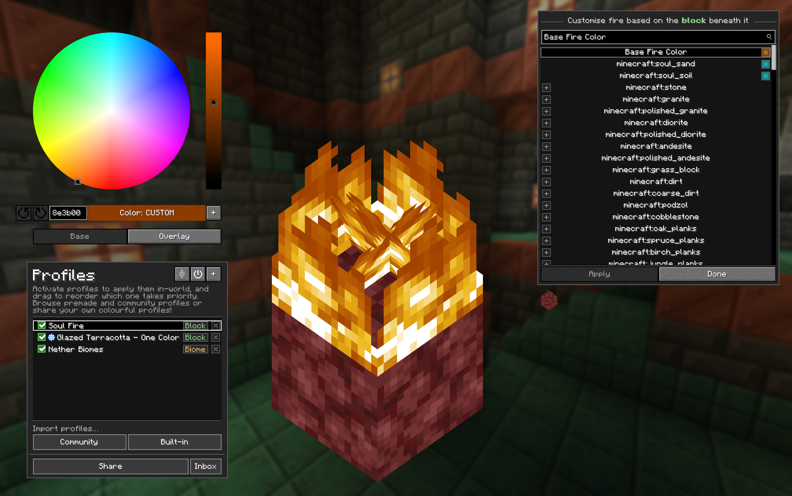
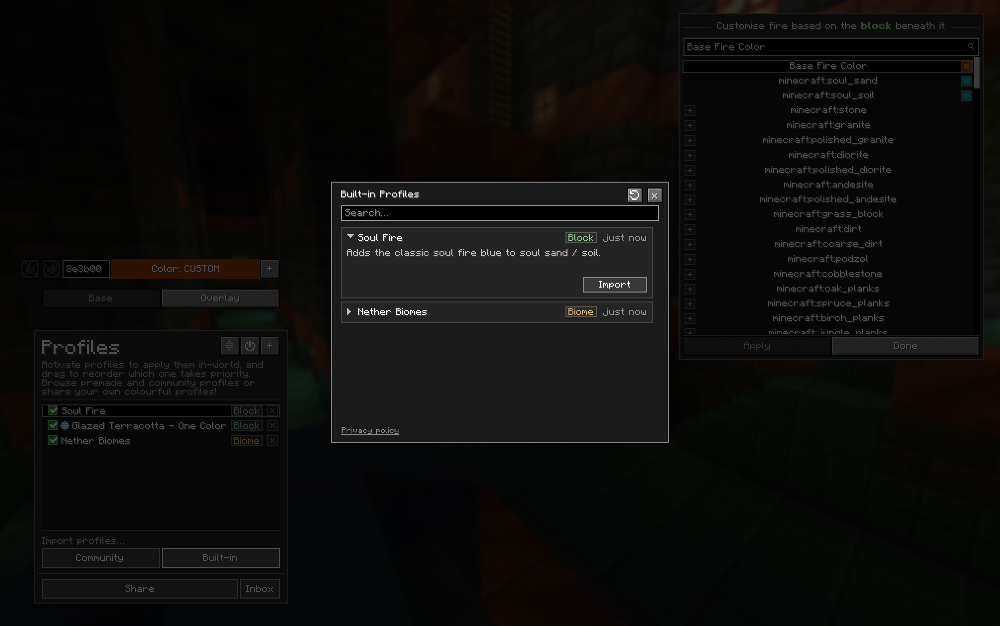
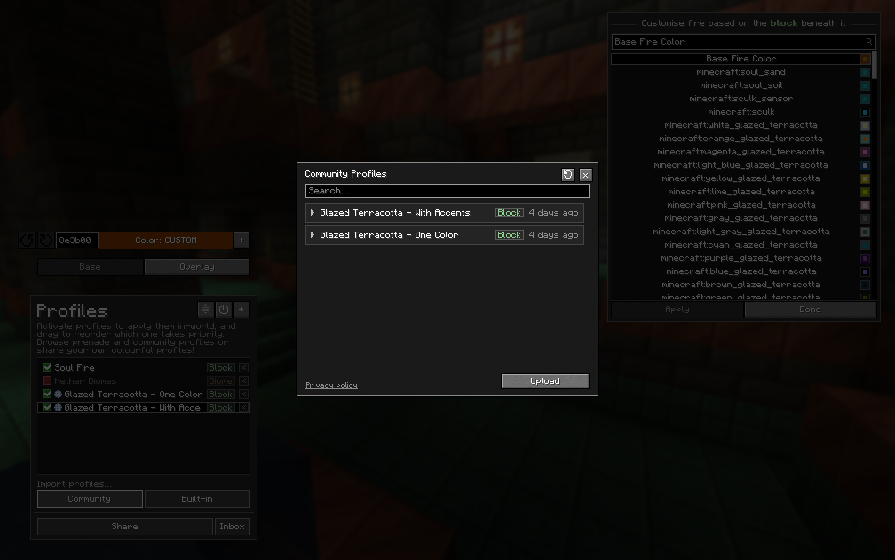
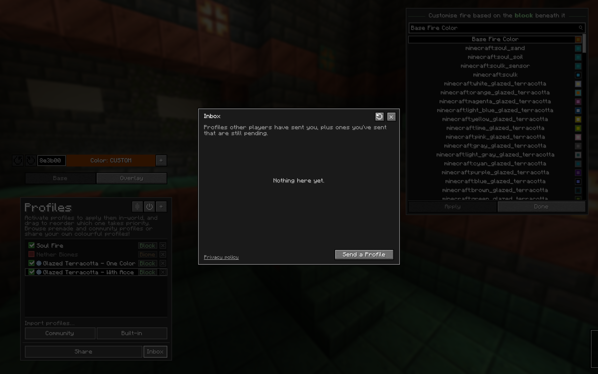
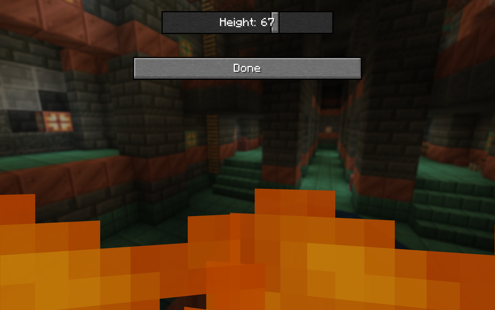

# Firorize

### Full colour customization for Minecraft fire

---

## What's this mod?

Are you bored of that same old orange fire? In need of more atmospheric nether biomes? Wishing for some
colorful variety next time you decide to burn your friend's house down?

**Firorize** lets you recolour fire however you like — per **biome**, per **block it sits on**, and per
**block tag** — with a priority system to settle any clashes. Group your colours into named **profiles**,
and now **share them with the whole community or send them straight to a friend, right inside the game.**

It's fully **client-side**, so it works on any server without installing anything server-side.

  

---

## Features

#### Colour customization
- Recolour the **base fire** to any colour you like
- Per-**biome** fire colours
- Per-**block** fire colours (based on the block the fire is ignited on)
- Per-**block-tag** fire colours
- Independent **base** and **overlay** tint control
- Adjustable **priority hierarchy** to resolve any colour conflicts
- Built-in **colour presets** for quick customizations

#### Profiles
- Save complete colour setups as named **profiles**
- Activate / deactivate and reorder profiles to get the customisation you want
- One-click **reset** back to a profile's defaults
- A preloaded **nether** profile to get you started

#### Online sharing
- **Built-in Gallery** — take a pick from many built-in fire profiles made by me
- **Community Gallery** — browse fire profiles shared by other players and import them with a single click
- **Upload** your own profiles to share them publicly
- **Inbox** — privately send your custom profiles to friends

#### Quality of life
- Simple, flexible configuration menu (open with **I** by default)
- Adjustable **fire-overlay height**
- Fixes the vanilla **soul-fire overlay** bug
- Works with **modded** blocks, biomes and block tags
- Compatible with **Iris** shaders

---

## Gallery

#### Built-in profiles, ready to import

Ship straight from a curated set — like the **Soul Fire** profile that restores the classic blue to
soul sand and soul soil — and import them with one click.

  

#### Browse and import from the community

Discover fire profiles shared by other players and add them to your collection instantly.

  

#### Send profiles straight to friends

Your **Inbox** collects profiles other players have sent you, and lets you share your own privately.

  

#### Adjust the first-person fire height

Shrink the first-person fire overlay so it's less obtrusive when you're on fire.

  

---

## Compatibility

| Mod | Notes |
| --- | --- |
| [Fabric API](https://www.modrinth.com/mod/fabric-api) | **Required** |
| [Mod Menu](https://www.modrinth.com/mod/modmenu) | **Required** (opens the config) |
| [Sodium](https://www.modrinth.com/mod/sodium) | Recommended for performance |
| [Indium](https://www.modrinth.com/mod/indium) | Required **if** Sodium is installed |
| Iris shaders | Compatible |
| OptiFabric | Incompatible |
